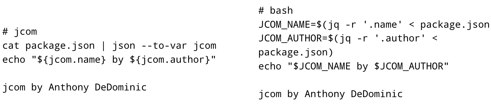
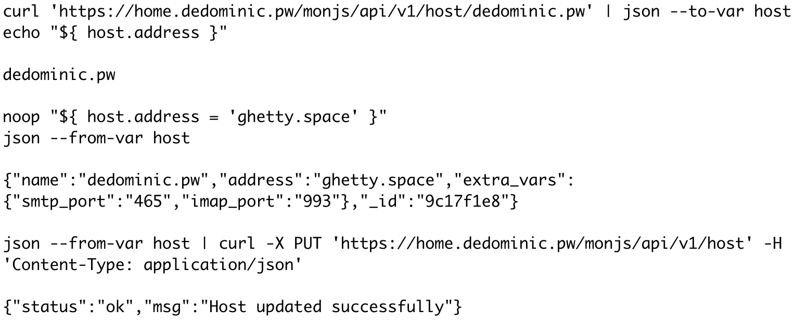
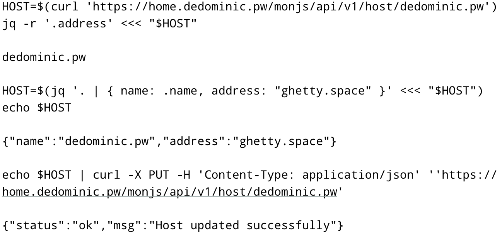
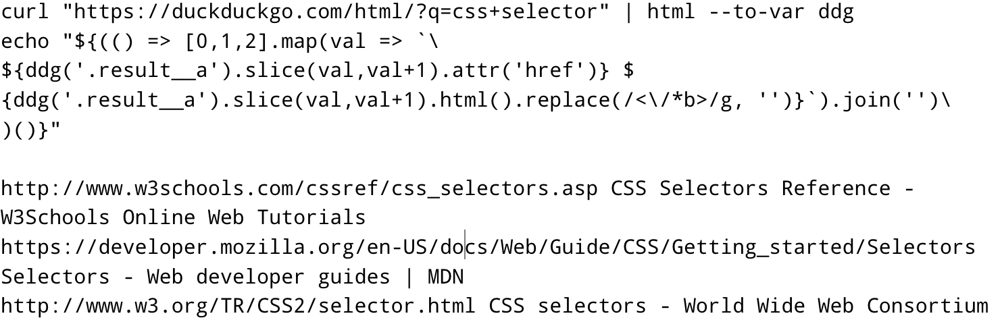

---
# Copyright (C) 2016  Anthony DeDominic
#
# Permission is granted to copy, distribute and/or modify this document
# under the terms of the GNU Free Documentation License, Version 1.3
# or any later version published by the Free Software Foundation;
# with no Invariant Sections, no Front-Cover Texts, and no Back-Cover Texts.
# A copy of the license is included in the section entitled "GNU
# Free Documentation License".
---

1. Introduction
===============

No popular shells, as of late, have the ability to handle modern structured documents, such as JSON.
Because of this, it is difficult to use shells for modern text and data handling.
This is especially the case for web oriented services;
such services heavily rely on transacting structured documents or serialized objects.

This limitation has resulted in the hassle of wrangling various line oriented tools such as the following: sed, grep, awk, xargs, tr, paste, cut, tee, etc, to try and derive value and data.
Thus, in a very contrived way, one has effectively wrote a parser.
An example of the problem can be seen in [Listing 1](#htmlparse)[^1].

[^1]: source: <https://github.com/GeneralUnRest/neo8ball-irc/blob/master/lib/search.sh>

~~~{#htmlparse .sh caption="Parsing HTML in bash"}
# gets an html webpage from duckduckgo, 
# processes it into
# "url - page description" lines 
# removes ad links
# and only preserves the first three
curl ${SEARCH_ENGINE}${4} | \
html2 | \
grep -A 2 "@class=result__a" | \
sed '/^--$/d' | \
sed '/@class/d' | \
grep -Po '(?<=\/a(=|\/)).*' | \
paste -d " " - - | \
sed 's/\(@href\|b\)=//g' | \
sed '/r\.search\.yahoo\.com/d' | \
head -n 3
~~~

1.1. Related Works
------------------

Object Oriented shells are not an entirely new concept.
Many projects, some more serious than others, attempted to solve this data-wrangling issue [@shcaml] [@oosh].

### 1.1.1. shcaml

Shells are very powerful tools.
In many cases, they also serve as the most basic ui of an operating system.
Most shells allow for tying streams of multiple processes togethet, allowing for interprocess communication.
Such mechanisms is what allows shells to complete complex tasks.
Because of this, many programming languages provide the ability to spawn shells.
An example is the function system(), in the standard C library.
The power of the shell was not lost to some OCaml[^ocaml] developers;
these developers created shcaml.
shcaml, a library, offers a more powerful shell spawning construct for the OCaml language.
A feature of shcaml allowed one to tie OCaml code with external commands as a sort of intermediate go-between.
This allowed for powerful data-wrangling functional compositions that could  take in data from shell commands and transform them into structured outputs [@shcaml].

[^ocaml]: OCaml is a popular functional language.

### 1.1.2. Named Pipe Shells

Another way of attaining structured inputs and outputs is through an object system.
One attempt at object oriented shells utilized named pipes and file descriptors to mimic objects [@oosh].
This resulted in a new process for every object; which created object encapsulation.

Each object still has limitations in terms of functionality;
They are basically just another shell with its own encapsulated data.
As a result, each object requires its own process, so large number of objects requires large amounts of processes.
Named pipes are not as secure as other means of interprocess communication;
This is because anyone with the same user privileges can write to and read from named pipes.

### 1.1.3. Lisp Shells

Lisp--another language that is function-oriented, shells have been other ways of trying to add structure.
examples are like Scheme Shell, and other academic ones [@shcaml][@lispsh].
The advantage lisp gives over other languages, which makes it suitable for shells, is that the program and data have the same form [@lispsh];
lisp code is effectively a mutable abstract syntax tree.
This property comes in handy in meta programming, where programs can dynamically change to handle certain data.
It is also a closed language, as in, one can pull from data that is in an outer functions.
Closure property is what gives lisp its ability to resemble structured documents.
Since lisp code is already in a abstract syntax tree form, JSON documents can represent lisp code.

### 1.1.4. Powershell

Projects like Powershell are built on the .NET runtime and can thus utilize all of the language features therein.
The streaming pipelines in Powershell are merely .NET classes which allow for some structural correctness and parsing [@shcaml][@monadshell].
As a result, Microsoft prefers to call it more than just a shell, but a whole "automation and configuration management framework."
This framework comes with a handful of features, like the capability of handling structured data such as JSON, XML, CSV, etc, REST APIs, and object models.

### 1.1.5. Ansible

Tools like Ansible, are not quite shells, but are domain specific languages which solve similar problems.
Ansible and Salt Stack use code generation and structured document format called yaml, to construct python code.
Since python is a general purpose language, it handles structured and typed data much better than shell code.
Ansible as a result has become a cornerstone of modern IT automation, provisioning and configuration management;
many of those listed problems require working with such data.

The next few sections will cover some background on important topics and issues around this space, basically what these prior works tried to solve.
Thus the next sections convey the problem that is being solved.

1.2. Service-oriented Architecture
----------------------------------

Service-oriented Architectures, or SOA, are modern way to construct, highly available, data rich web applications.
In short, a service oriented architecture is a way for applications to share state and provide services over middleware and structured, serialized objects.
[@soa]
One way of transacting states between services is through Representational state transfer, or REST.
With REST, services are able to share well structured data through document structures like JSON, XML and many others. [@semanticrest]

POSIX-shells, on their own, are completely useless for interacting with service oriented architectures.
Generally when dealing with web APIs it is recommended to build a script--using a general purpose language[^exlangs], instead.
If an ansible module exists, one might want to consider that as well.

[^exlangs]: Examples: Python, JavaScript, Perl, Ruby.

1.3. Designing and Defining a Domain Languages
----------------------------------------------

Designing domain specific languages is a very slow and arduous task.
Some have suggested designing and developing domain specific languages using meta-models; 
basically a model, modeling models [@dsldes].
This process makes use of advanced features of UML version 2.1.
This also has the added benefit of code generation.

Defining a language is ultimately the process of creating formal grammars.
Generally this is done empirically, basically from experience, trial and error.
Some have used machine learning and bottom-up CYK based parsers to generate grammar [@synthcfg].
This would be useful for languages built using example strings of unknown structure than more well defined languages.

1.4. Events
-----------

Some system events may impact other systems.
Currently, other than using triggers, there is no way to define listen events in POSIX shells.
Powershell offers such functionality through the power of its .NET classes [@monadshell].
To accomplish a similar function, one must use a blocking statement such as one shown in [Listing 2](#event)

~~~{#event .sh caption="Event driven programming in a shell"}
# file descriptor is needed 
# for performance reasons
exec <>99 /some/named-pipe
# consumes a process, must be backgrounded
while read -r line; do 
    echo $line 
done <&99 &
echo "event" >&99
~~~

Given that package management tools, used in many linux distributions, use shell like scripting, and have a post-install process, it may be helpful for a user to define his own post-install event handlers or notifiers.

1.5. Portability Concerns
-------------------------

Shells are the primary interface into a POSIX system.
As a result, many tools and utilities rely on shells to handle and process files and their data.
A collection of standard tools exist to accomplish this goal.
This collection is called the coreutils.
Despite the POSIX specification, different coreutils may be implemented with different, nonstandard features and capabilities.
For instance, many of the GNU coreutils--such as their implementation of grep, df and even readlink, add features not strictly standardized by POSIX which can be seen in [Listing 3](#nonstandard).

~~~{#nonstandard .sh caption="Nonstandard use of POSIX standardized grep"}
# (?>) is a backreference in PCRE
# -P flag enables PCRE grep 
# in the GNU coreutils
grep -P '(?>=)somepat' file 
# does not work on macOS, which uses, 
# mostly, BSD coreutils
~~~

Different operating systems--ranging from GNU-based Linux distributions, The BSDs and other non-free systems like macOS, Solaris, AIX, and other UNIX, can potentially use different coreutils.
Thus, this means that shells scripts can depend on behaviors and unstructured output that are not portable.

1.6. Going Further
------------------

### 1.6.1. Interactively

An OCaml library called shcaml added functional combinators called shtreams which allow for transforming byte streams into structured documents [@shcaml].
However, it is merely a library, to be used in making OCaml programs.
It was not intended to be used interactively.
This makes it unsuitable as an actual systems shell.

### 1.6.2 Readability

Some developers have tried to add other structures to shell input, such as Scheme Shell and other implementations [@lispsh].
Using functional composition, one can construct a very powerful shell, but it will not be as clear and concise as normal shell syntax.
this is because lisp does not allow for pipelining-like syntax.
For instance, consider [Listing 4](#lispshell) where one must use a variadic pipe function vs [Listing 5](#shellpipe) which shows a basic pipeline.

~~~{#lispshell .lisp caption="A lisp shell pipeline"}
(| 
  (cat somefile)
  (some-command))
~~~

~~~{#lispshell .sh caption="Shell pipeline"}
cat somefile | some-command
~~~

### 1.6.3. Performance

The named-pipe shell would simply be too slow.
The need to spawn new processes for each object and dealing with potentially slow named pipe interaction is too heavy [@oosh].
One can used file descriptors trick to enhance the performance of named pipes.

1.7 Objective
--------------

Given all the above, the goal is to build a new shell.
This shell should be able to execute simple commands and offer basic shell features like pipelining.
To differentiate it from other shells, it should be able directly work and manipulate modern data structures and documents like JSON.
The shell should be fully interactive, like a shell is suppose to be.
The shell should keep with traditional POSIX shell syntax as much as possible, both for readability concerns, but also for familiarity.
Ideally it should be fast, but since it will be written in a scripting language, this may be unattainable in this current project.
To extend the shell's functionality, it is necessary that it have a plugin system.
The plugin system will allow for added features and capabilities.

Ultimately, the goal is to see what a shell with objects can do.
It is the goal of this research not only to build a shell, but to also observe the positive utility and advantage of the shell being developed.

1.8. Summary of Results
-----------------------

Below, this paper will cover the features of the shell[^progress].
The paper will discuss how the program stores variables, including objects, or documents.
It will also show examples of usage, both manipulating and using variables.
Other examples, such as use cases and the plugin system will be demonstrated.

The final section will show real uses of the shell.
This will include code examples, one in jcom and one in bash.
Finally a comparison in how many lines of code and characters needed, will be made.

[^progress]: As of this revision, some features like events are not implemented.

2. Materials and Methodology
============================

In order to make use of the technologies described, first the user must have NodeJS.
The version of node being used on the test machine will be the latest--as of this writing, v7.1.0.
With NodeJS comes crucial tools like npm.
npm is the tool that handles dependencies;
The project makes use of such dependencies like pegjs.
When downloading the source of the project from github.
It is necessary to run npm install to require dependencies.

The project is version controlled using git and is hosted on a remote repository on github[^git].
The easiest way to check out the project would be to clone it using a git utility.
npm can also download the latest build of the project given the url in the footer;
this is done by typing npm install url.

[^git]: Source: <https://github.com/adedomin/jcom>. You can Acquire the source using: git clone <https://github.com/adedomin/jcom>

### 2.3.1. Libraries

The project makes use of the following libraries.
For a more up-to-date list, please consult the package.json file in the project which lists all the dependencies and their semver version number:

  * pegjs - parser generator
  * lodash - utility functions for functional array and object handling.
  * js-yaml - a yaml parser for javascript, for an example plugin
  * various NodeJS built-ins: fs, process, readline, etc.

### 2.3.2. Testing Environments[^presentation]

[^presentation]: Note in the presentation, testing and development was done soley on a macbook.

The machine being used for testing is a Fedora GNU/Linux, release 24, virtual machine running on a Windows 10 Hyper-V hypervisor.
This hypervisor has a Core i7-3930k processor and 32GB of memory.
The virtual machine has been allocated 2 cores of the 6 physical, with dynamically resizing memory, up to 16GB.
To ensure support for the latest features and capabilities, the latest release--as of this writing, v7.1.0, was installed on the machine.
Interaction with the machine will be done over a network;
this is accomplished using a remote shell protocol called secure shell (ssh).

Any and all scripts necessary to reproduce the results will be made available in the github link provided in the footer.
Please consult the examples/ directory in the repository.

3. Results
==========

3.1. Objects and Structured Documents
-------------------------------------

![Variable workflow[^vars]](media/variables.png)

[^vars]: This shows how one makes use of variables and the ways to get and set them.

The main objective of the project is to process structured documents.
To accomplish this, the language will offer a plugin system.
Plugins in this context are merely JavaScript functions which return--or return a value via a callback, JavaScript objects.
This workflow can be clearly seen in Figure 1, which shows how a user's input line can be saved into a variable.
Currently, as this figure shows, one can only assign values to variables using the templating engine or a plugin.
[Listing 6](#varstore) shows, internally, how this storage works in the shell.
This is normal JavaScript assignment.

~~~{#varstore .javascript caption="Variable assignment, internal"}
// store some input or output buffer
// parsed by a plugin named parseJson
SHELL_VARS[ident] = parseJson(buffer)
// a plugin that uses xpath to 
// select some values from an 
// XML document and stores it
SHELL_VARS[ident2] = xpathSelector(
    buffer, args
)
~~~

Ultimately, the variables are stored in one giant JavaScript object.
This is how JavaScript functions, closures and objects store variables locally.
Because of this, it simplifies variable storage and management of variables of jcom.

To access these stored variables, as shown in [Listing 7](#varaccess), Variables are accessed using javascript ES6, template literal, syntax.
[Listing 6](#varaccess) also shows counter examples of variable access in bash, the comments in the example delineate the two.

~~~{#varaccess .javascript caption="Accessing variables in jcom"}
// getting an array element from an object
${somevar.somearr[1]}
// bash does not have nested objects
${somevar[1]}
// iterate over every element in an array
${somevar.forEach(var => do something)}
// bash
for var in ${somevar[@]}; do 
    something
done
// NESTED OBJECTS
// not possible in bash as of v4.3
${somevar.someotherobj.somekey.moreobjs}
~~~

Again, as shown in the above example, javascript notation and variable storage opens up an avenue to handle various kinds of data.
This opens up possibilities to accomplish more general tasks that normally is left to general scripting languages[^exlangs].

3.2. Events
-----------

![Event workflow[^event]](media/events.png)

[^event]: This shows how the event system works by registering commands or daemons to labels and invoking or feeding more data into them using an accompanied emit.

One feature shells have is the ability to create file descriptors.
With these, users have a fast way of connecting programs.
File descriptors are usually how one would recreate--what could best be described, as an event loop.

NodeJS offers an object called an EventEmitter.
With it, one can create software with low coupling.
EventEmitters are very simple, the only two methods that are of importance are on() and emit().
emit() lets one create an event labeled by a string, to be handled by an on().
The on() handles events of a particular label with a function.

The event system of jcom can be seen in Figure 2.
The user inputs a command line.
If the line invokes the on command, it takes the first argument as a label and the second as a command to execute.
The on command will take the first argument as a label and will invoke the command associated with that label.
To make these events useful, the emit command accepts an input stream and will feed it into the command.

~~~{#events .sh caption="jcom event system example"}
# prints what it is fed
on 'echo' cat
# will print hello, world
echo 'hello, ' | emit 'echo'
echo 'world' | emit 'echo'

# reload config on config change
on 'configChange' \ 
    "kill -SIGWINCH ${some_server_pid}"
# load inf parser plugin
load parse-ini
parse-ini SERVER_CONFIG /etc/server_config
echo "db://newdb.url" \ 
    | toVar "SERVER_CONFIG.db_url"
parse-ini SERVER_CONFIG \ 
    --serialize -o /etc/server_config
# reload changed config
emit "configChange"
~~~

[Listing 8](#events) shows these events can be incredibly useful for tasks such as reloading a server when a configuration file is changed.
It also demonstrates the power of the plugin system.
Users can create plugins to parse their configurations into javascript objects.
This allows for an easy way to manipulate configurations and reconstitute them, with changes, back to a file.

3.3. Command and File Parsers
-----------------------------

![Document parsing and manipulation[^doc]](media/doc.png)

[^doc]: This shows how commands feed serialized documents and how plugins manipulate the shell's variable pool to store them.

As shown in [Listing 8](#events), the shell can simplify some common configuration tasks.
Many common shell tasks involve handling file data.
Seemingly simple tasks, like modifying configuration files, usually require the user to open up a text editor and leave the shell.
Such interactions are generally not possible for automation scripting.
In order to overcome some of these challenges, Users usually have to do something akin to [Listing 1](#htmlparse) where they string together various commands to parse and transform the file.

Like JSON documents, many times configuration files have some formal structure.
A common structure is the key:value pattern.
Usually files have keys and their values and they are separated by a simple equality sign;
such files are easily handled by tools like grep and sed.

More advanced configuration structures like ini files, give the user the ability to have single-level nested objects and comments.
These files can still be easily transformed with basic line oriented tools.
However, consider rich configuration structures like YAML or even Java .properties files.
These structures can have infinitely nested objects, arrays and various primitive types.
Such configuration files become harder to modify with line oriented tools.
However, consider [Listing 9](#parseconfig).
Like Figure 3, It shows how one leverages a plugin to read in a file, deserializes it into a jcom variable and how a user can turn this variable into a file via a serialization mechanism.
This allows one to edit files without resorting to a text editor, opening up opportunities to automate configuration management.

~~~{#parseconfig .sh caption="jcom parser plugin example"}
# parse nagios's main configuration
load nagios-parser

nagios-parser --to-var NAGIOS nagios.cfg
 # prints info related to host1
echo ${NAGIOS.host1}
${NAGIOS.host1 = {new obj}} # new host1
nagios-parser --serialize -o nagios.cfg
~~~

3.4. Outcome, Examples
----------------------

In this section I will be showing real examples of jcom being used and comparing them to bash examples.
The purpose of this is to objectively measure if jcom requires less lines of code or number of characters than an equivalent bash script.

### 3.4.1. Example 1

Referring to Figure 4, this simple example shows how to read in a JSON document and accessing data within it.
One thing to note is how the bash script has to parse the file multiple times in order to store the variables.
However, both were able to complete the task.

### 3.4.2. Example 2

This example, which references Figures 5 and 6, shows an interaction with a webserver.
The jcom one, Figure 5, shows off its ability to store documents, deserialized, into JavaScript objects.
Because assignment functionality is not implemented, the noop line shows how one can manipulate and assign values to variables.
The next lines show off the serialization feature which allows a user to return a variable as a document.
The variable is then returned to a document, where it is fed into curl so i can be sent to the server.
The server confirms that the update was successful.

Figure 6 shows an equivalent script written in bash.
It's mostly the same, the only difference is the use of jq to parse a json string, which is stored in the HOST variable.
One interesting thing to note is how the HOST json string is modified.
Some information could have potentially been lost.
Only name and address are preserved after the modification.

### 3.4.3. Example 3

This example, seen in Figure 7, shows how jcom can work with other structured documents.
This example shows an HTML plugin which allows the user to find information using CSS selectors.
One thing to note, all of the code in the template string is javascript.

Listing 1 shows the bash counter example.
This shows that what tools are available strongly affects the outcome for bash.
This example makes use of a tool called html2--a tool to transform html into greppable lines.
Because the html was transformed into line friendly output, its possible to use coreutils seen--grep, sed, etc, to obtain the information needed.

### 3.4.4. Lines of Code

$$
\begin{tabular}{lrr}
    Example & Lines of code & \# of characters \\
    \hline 
    jcom example 1 & 2 & 76 \\
    bash example 1 & 3 & 131 \\
    jcom example 2 & 5 & 287 \\
    bash example 2 & 5 & 303 \\
    jcom example 3 & 4 & 245 \\
    bash example 3 & 10 & 270 \\
\end{tabular}
$$

As can be seen from this table, jcom used less lines of code in examples 1 and 3.
On every example, jcom used less characters overall.

4. Discussion
=============

4.1. Significance
-----------------

The examples, 1 through x, shows a greater level of simplicity and power in handling structured documents.
It makes use of common dot notation to access methods and member variables in objects.
This is unlike many shells which can only store simple scalar values or vectors of these values.

Communication with web services--as demonstrated in example x, felt simpler.
There was no need for complex tools like jq, or line oriented sed transformations, to accomplish the needed updates to the data.
In order to properly and safely leverage middleware oriented architectures, objects should be in shells.

4.2. Limitations
----------------

Currently, the shell is not finished.
For instance, branching is not implemented.
There are stream related issues which prevent writing to files.
Assignment and events are currently not implemented as of this revision.
That being said, assignment can be done using the JavaScript Templating engine.
    ${ somevar = 'value' }
Currently the only thing that works is execution pipelining;
thus many of the examples shown should be runnable.

The JavaScript templating engine sort of blurs the lines of the shell component and JavaScript.
The templating engine effectively allows the user to execute JavaScript inline.
It can also slow the engine down since the parser is run after the JavaScript as been evaluated.
Also, the templating engine makes use of an old JavaScript function which should be avoided, like with();
with() may be removed in later versions of the language which would slightly complicate variable access as it is currently designed.

Even though the examples 1 through x used less lines of code and less characters used, the difference was not that staggering.
In many cases jcom only beat out a comparable bash script by 30%.
It also shows that tools like jq make it possible for bash to work with complex document formats.

4.3 Future Works
----------------

Currently jcom needs more work.
Many of the bugs and features should be fixed or implemented.
After that is complete, more complex examples should be developed.
These examples should try to find things not even a shell can do in a reasonable amount of lines of code[^sig_line].

[^sig_line]: By reasonable, I mean three or four times more lines of code than a jcom example.

With better examples and a fully functioning example shell, attempts should be made to add object like features to shells like bash.
Because shells like bash have a large userbase, it is hard to fully deprecate it.
Because of this, for object-like features to become mainstream, they have to implemented in bash.
Thus the next step would be to fork bash, implement some or all of the features--as were discussed in the results section, and then submit a pull request.

4.4. Conclusion
---------------

The results show that jcom simplifies some use cases.
This is a result of the syntax, but also the ability to store complex data structures in the shell's variables.
Because of this, it feels more natural to use overall.
The next step is to try and push these modern features into current, popular shells.
